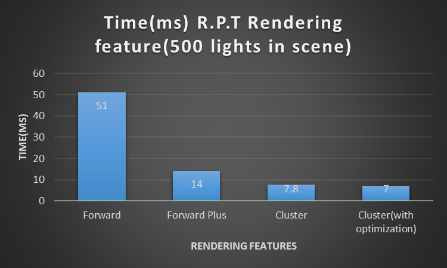

WebGL Clustered and Forward+ Shading
======================

**University of Pennsylvania, CIS 565: GPU Programming and Architecture, Project **

* #### Author information

  - Tianming Xu (Mark)
    - www.linkedin.com/in/tianming-xu-8bb81816a (LinkedIn)
  - Tested on: Windows 10, i7-8700 @ 3.20GHz 16GB, GTX 2080 8192MB (my personal desktop)

Demo Video/GIF

### Demo Video/GIF

[https://youtu.be/zsqNUDt5a4s] youtube link of the demo

### Feature Lists

- Forward Plus rendering
  - Render the scene using only the lights that overlap a given cluster
  - Build a data structure to keep track of how many lights are in each cluster and what their indices are
- Cluster Rendering
  - Store vertex attributes in g-buffer
  - Read g-buffer in a shader to produce final output
- Special Effect
  - Implement deferred Blinn-Phong shading (diffuse + specular) for point lights
- Optimize the performance of the program
  - Pack g_buffer into 2 vec4s
  - store normal by two values and compute the third within shader
  - a little problem when the z value is negative

### Performance Analysis

[

From the chart above we can see the performance difference among all the rendering features.

For Forward Plus, as we don't need to traverse all the lights to compute the color of objects, the performance increases significantly from simple Forward rendering.

For Cluster rendering, as we store the necessary vertex attributes to g_buffers. We don't need to go through all the objects in that cluster. We only need to compute the light effect on the closest object, which saves some computation power as well.

For the normal compaction optimization, we store 2 instead of 4 g_buffer, so the bottleneck of performance of the Cluster rendering also increase a little bit. It will be more obvious if the light count increases.

### Credits

* **Jiangping Xu**, Jie Meng and GangZheng Tong helped me a lot, especially Jiangping who taught me how to compute the cluster-camera interaction to determine the min and max x and y index of the light affects.
* [Three.js](https://github.com/mrdoob/three.js) by [@mrdoob](https://github.com/mrdoob) and contributors
* [stats.js](https://github.com/mrdoob/stats.js) by [@mrdoob](https://github.com/mrdoob) and contributors
* [webgl-debug](https://github.com/KhronosGroup/WebGLDeveloperTools) by Khronos Group Inc.
* [glMatrix](https://github.com/toji/gl-matrix) by [@toji](https://github.com/toji) and contributors
* [minimal-gltf-loader](https://github.com/shrekshao/minimal-gltf-loader) by [@shrekshao](https://github.com/shrekshao)
