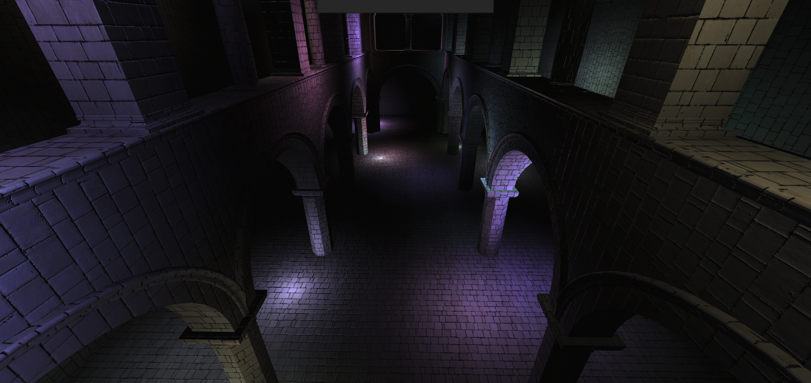
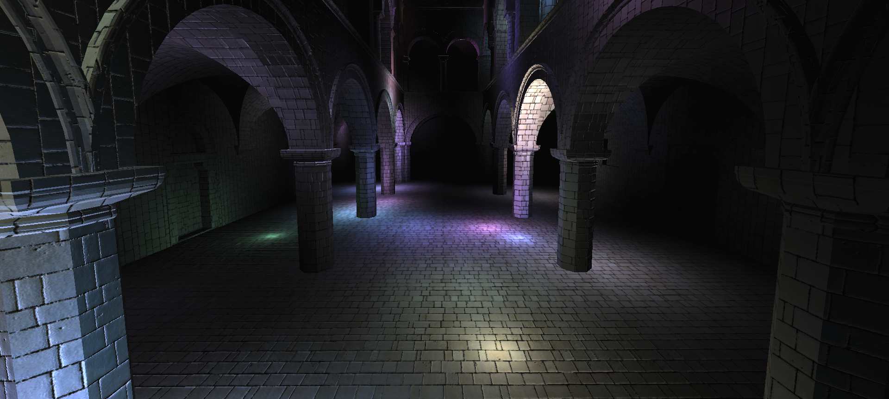
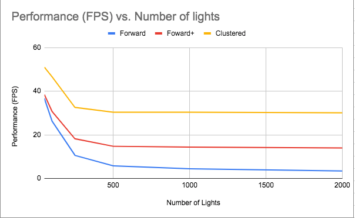
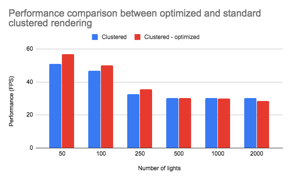

WebGL Clustered and Forward+ Shading
======================

**University of Pennsylvania, CIS 565: GPU Programming and Architecture, Project 5**

* Saket Karve
* Tested on: (TODO) **Google Chrome Version 78.0.3904.70 (Official Build) (64-bit)** on
  MacBook Pro, 2.3 GHz Intel Core i5 @ 8GB, Intel Iris Plus Graphics 640 1536 MB

### Demo GIF

### Features

- Forward Plus rendering
- Clustered rendering
- Clustered rendering - optimized g-buffer
- Performance Analysis

### Output

**Forward Plus**

**Clustered**

### Performance Analysis

The above graph shows a comparison between the three rendering techinques with increasing number of lights. As expected, the clustered rendering has the best performance. Forward plus has a significant improvement over forward rendering. Clustered rendering is a deffered rendering technique and is optimized in terms of the shading is done based on a smartly filled g-buffer in the first pass. 

Optimizing the g-buffer to utilize as much we can in each vec4 and passsing as minimum information as possible helps in improveing the performance further. It can be seen that the optimized version is better than the standard clustered rendering in most cases. The effect is not significant for more number of lights.

### Credits

* [Three.js](https://github.com/mrdoob/three.js) by [@mrdoob](https://github.com/mrdoob) and contributors
* [stats.js](https://github.com/mrdoob/stats.js) by [@mrdoob](https://github.com/mrdoob) and contributors
* [webgl-debug](https://github.com/KhronosGroup/WebGLDeveloperTools) by Khronos Group Inc.
* [glMatrix](https://github.com/toji/gl-matrix) by [@toji](https://github.com/toji) and contributors
* [minimal-gltf-loader](https://github.com/shrekshao/minimal-gltf-loader) by [@shrekshao](https://github.com/shrekshao)
