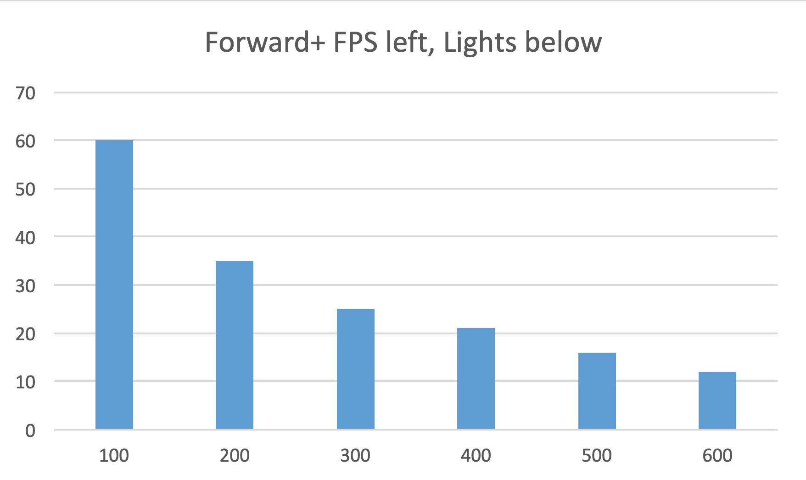
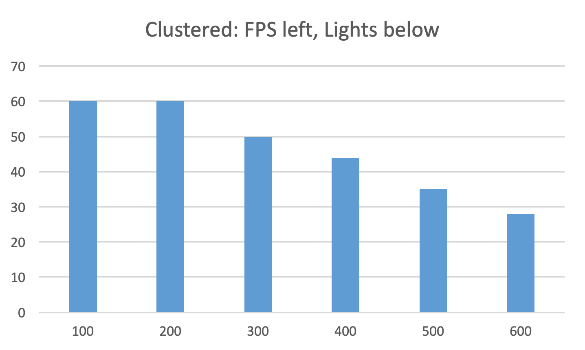
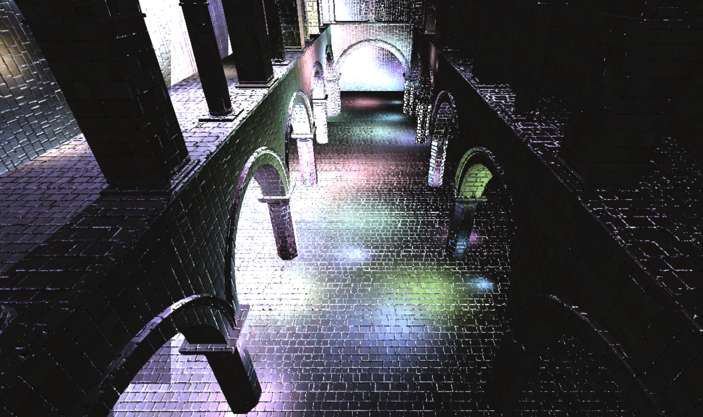

WebGL Clustered and Forward+ Shading
======================

**University of Pennsylvania, CIS 565: GPU Programming and Architecture, Project 5**

* Alexis Ward
    * [LinkedIn](https://www.linkedin.com/in/alexis-ward47/), [personal website](https://www.alexis-ward.tech/)
* Tested on: **Google Chrome 77.0.3865.120 (Official Build) (64-bit)** on
MacBook Pro (Retina, 15-inch, Mid 2015) Mojave 10.14.2, Intel Iris Pro 1536 MB, AMD Radeon R9 M370X 2048 MB

### Live Online

### Demo Video/GIF

# README

In this repository, I have created implementations of Forward+ and Clustered shading in order to compare their performances. I can't seem to get a good representation of milliseconds (the number is usually 0,1), I'm so sorry, so performance analyses are in FPS.

## Forward+

### Number of Lights vs FPS (Higher is Better)

## Clustered

### Number of Lights vs FPS (Higher is Better)

## Effects

 Started writing a Gaussian shader, but must get back to this at another time.

### Blinn Phong

Uncomment lines 127 - 130 in `deferred.frag` to view.

## Optimizations

I reduce number of properties passed via g-buffer by using 2-component normals, which means I only record the x and y normal values, and I compute the z value in the deferred fragment shader. Sadly, this creates a weird 'pinching' effect in the reflections, when the lights get close to a surface

The frame rate with this optimization was 59.96 fps on average, without it was 58.8.

## Comparison of Forward, Forward+, and Clustered at 100 Lights in

### Credits

* [Three.js](https://github.com/mrdoob/three.js) by [@mrdoob](https://github.com/mrdoob) and contributors
* [stats.js](https://github.com/mrdoob/stats.js) by [@mrdoob](https://github.com/mrdoob) and contributors
* [webgl-debug](https://github.com/KhronosGroup/WebGLDeveloperTools) by Khronos Group Inc.
* [glMatrix](https://github.com/toji/gl-matrix) by [@toji](https://github.com/toji) and contributors
* [minimal-gltf-loader](https://github.com/shrekshao/minimal-gltf-loader) by [@shrekshao](https://github.com/shrekshao)
