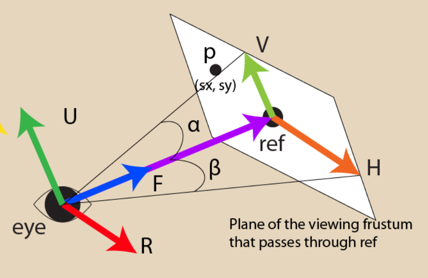
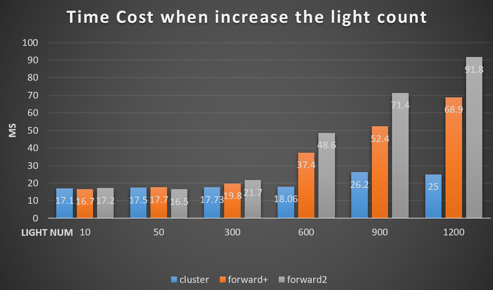
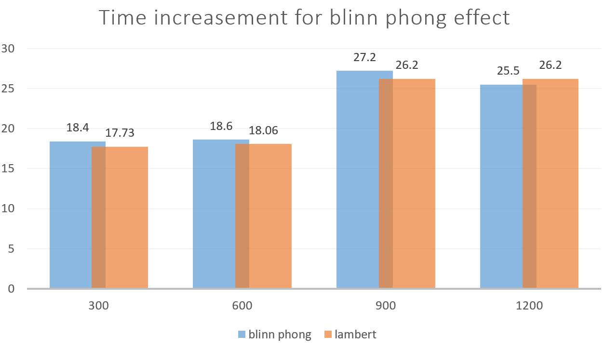
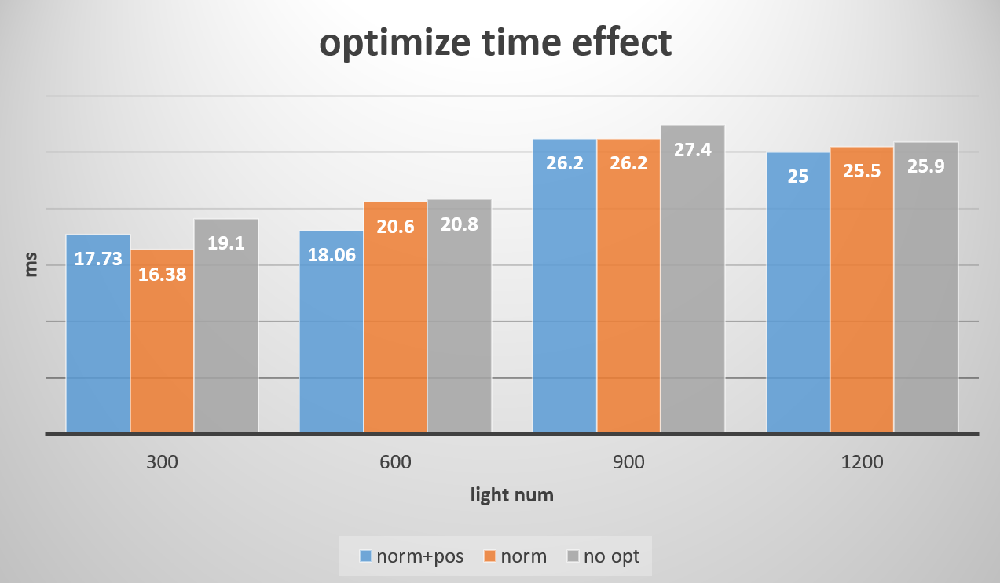
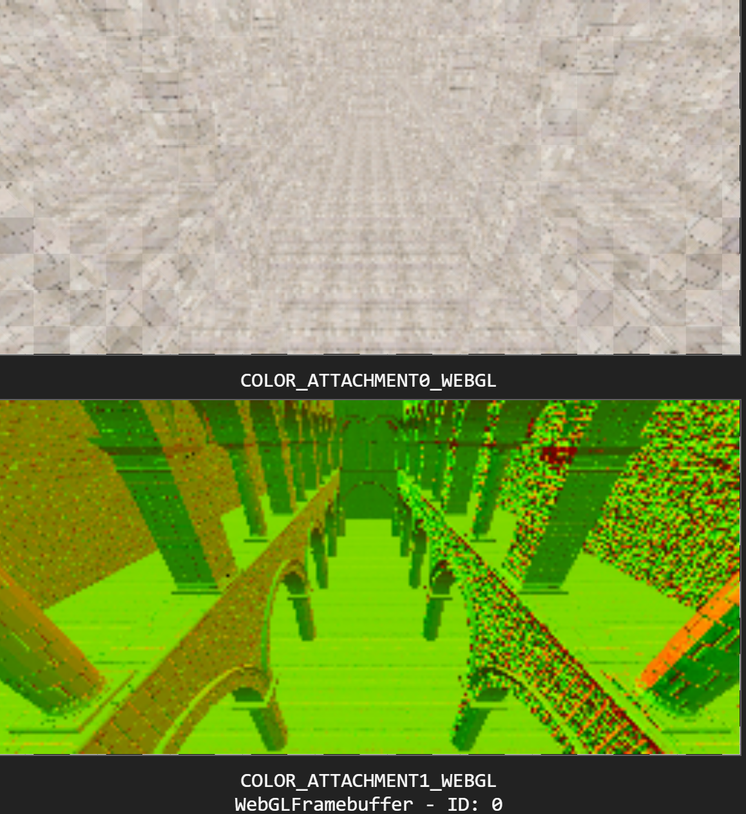

WebGL Clustered and Forward+ Shading

**University of Pennsylvania, CIS 565: GPU Programming and Architecture, Project 6**

* Yan Dong
  - [LinkedIn](https://www.linkedin.com/in/yan-dong-572b1113b/)
  - [personal website](https://www.coffeier.com)
  - [github](https://github.com/coffeiersama)
* Tested on: Windows 10, i7-8750 @ 2.22GHz  (12CPUs)  16GB, GTX 1060 14202MB (OMEN 15-dc0xxx)

### Live Online

[](http://TODO.github.io/Project5B-WebGL-Deferred-Shading)

### Demo Video/GIF

video: https://vimeo.com/370961664

## Feature

##### forward+


##### blinn+clustered


- **Forward+**
  - Making cluster buffers, divide the view frustum space into XSlices * YSlices* Zlices clusters

- **Clustered**
    - Store vertex attributes in g-buffer
    - Read g-buffer in a shader to produce final output
- **Effects**
  - Implement deferred Blinn-Phong shading (diffuse + specular) for point lights
- **Optimizations**
  - Pack values together into vec4s
  - Use 2-component normals
  - Reconstructing world space position using camera matrices and X/Y/depth

## Some Tricks

- ##### Glint

  At first, I use the view frustum culling to throw lights that do not show in the view space, but after doing that, I find the forward+ scene is somehow different compared to the forward. To make a deeper analysis, I think this is because the ***cubicGaussian*** light calculation. When the light is outside but near to the boundary, it still affect the scene and support some light color. I make the effect radius a little bit large to put more lights in the cluster buffer.

  

- ##### Normal deferred storage

  This is a trick when I find a technique in the cry engine. Named ***spheremap transform.***

  encode normal into spheremap and decode in the fragment shader. How to do is based on the reference. This method has little loss compared to others.

  

## Performance Analysis



##### Forward+ vs Clustered 

  - ##### Is one of them faster?

    I think the clustered + deferred shading is more faster since we store the albedo, normal, and v_position in the texture and we can just do a simple quad shading. Rather than doing concurrent fragment shading and calculating lightcolor in it.

  - ##### Is one of them better at certain types of workloads?

    We can see from the chart that when light count is very small, the forward+ method is almost the same speed with the clustered. Otherwise it seems that the cluster is the fastest. 

    Guess: when there are few lights, the concurrent fragment shading is not too time costing, since we use lightbuffer and colmap, normap to get the basic information. The most time costing part is doing the diffuse light shading, but as the light count decrease, we do the diffuse shading less times. So the clustered and forward using almost same time.

  - ##### What are the benefits and tradeoffs of using one over the other? For any differences in performance, briefly explain what may be causing the difference.

    Forward+:  culling out the lights do not affect the simple cluster and do the pipeline shading. The benefit of it is saving time by making sure the effect scale of each light.

    Trade off: sometimes do not do optimization~(eg. light count is small)

    Cluster: binding extra buffer texture, saving buffer texture, reading buffer texture is more complex. But it saves time. After saving the infos, all we need to do is reading data from different buffers, and do some multiplication, just like drawing. 

    Tradeoff: we do not do the real pipeline shading, so, a little twist and loss in the texture buffer can make our scene seems not real.  Cannot do the transparency.

##### Blinn Phong



  - ##### How to write blinn-phong?  

    see here:[https://en.wikipedia.org/wiki/Blinn%E2%80%93Phong_reflection_model](https://en.wikipedia.org/wiki/Blinn–Phong_reflection_model) 

  - ##### Performance change due to adding the feature.

  - ##### How might this feature be optimized beyond your current implementation?

    I come up with two methods, both of them are doing trade with quality, but can get speed acceleration.

    - calculate the blinn phong in the .vert and then pass the color to the .frag, the shading in .vert is less time costing.
    - save the view direction in the buffer (or H), and read it in the .frag to do the blinn-phong shading.

##### Optimization



  - normal xy

  - rebuild world position (pNDC is the v_position in ndc, and p is v_position in camera space)

  - store data together

    ```
     			gl_FragData[0] = vec4(col, pNDC.z);//albedo
      			gl_FragData[1] = vec4(norm.xy, p.z, 1.0);//vpos
    ```

    ##### What is the best case scenario for your performance improvement? What is the worst? Explain briefly.

    When the light count is large, the performance improvement is not so obvious. I think these tricks save the time for storing the buffer texture, binding the buffer and reading the buffer.

    ##### Are there tradeoffs to this performance feature? Explain briefly.

    Trade off: for normal there is some loss.

    |    GBUFFER(2)    |
    | :--------------: |
    |  |

    

## Reference and Thanks

 https://aras-p.info/texts/CompactNormalStorage.html 

 https://www.slideshare.net/guest11b095/a-bit-more-deferred-cry-engine3 

Thanks haco (Jiangping Xu) and Zheyuan Xie and Gangzheng tong for helping me!

In writing readme, in coding, in my studying life.


### Credits

* [Three.js](https://github.com/mrdoob/three.js) by [@mrdoob](https://github.com/mrdoob) and contributors
* [stats.js](https://github.com/mrdoob/stats.js) by [@mrdoob](https://github.com/mrdoob) and contributors
* [webgl-debug](https://github.com/KhronosGroup/WebGLDeveloperTools) by Khronos Group Inc.
* [glMatrix](https://github.com/toji/gl-matrix) by [@toji](https://github.com/toji) and contributors
* [minimal-gltf-loader](https://github.com/shrekshao/minimal-gltf-loader) by [@shrekshao](https://github.com/shrekshao)
