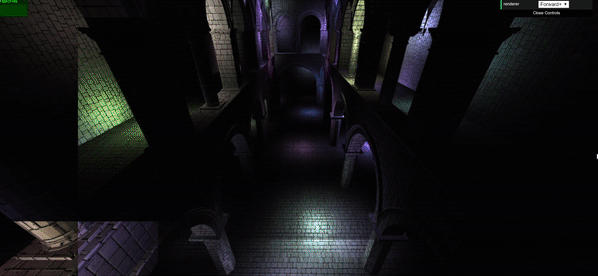
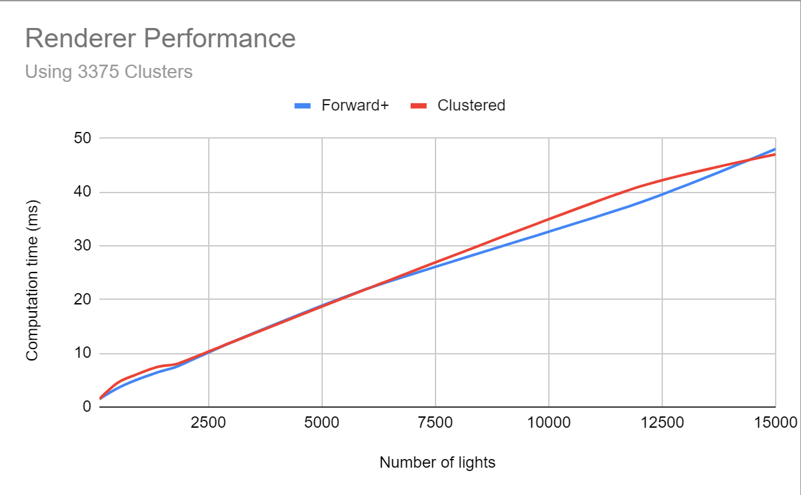
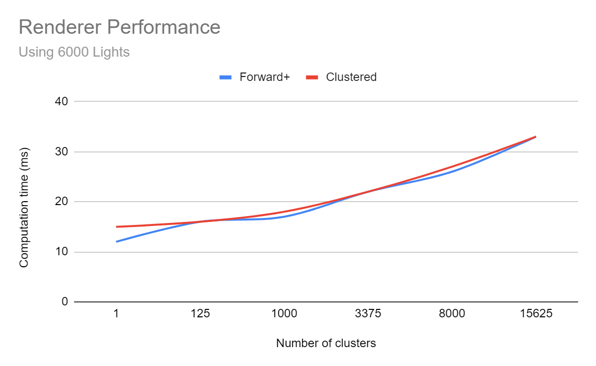

WebGL Clustered and Forward+ Shading
======================

**University of Pennsylvania, CIS 565: GPU Programming and Architecture, Project 5**

* Joshua Nadel
  * https://www.linkedin.com/in/joshua-nadel-379382136/, http://www.joshnadel.com/
* Tested on: Windows 10, i7-6700HQ @ 2.60GHz 16GB, GTX 970M (Personal laptop)

### Live Online

### Demo Video/GIF

### Overview

This project implements improved real-time rendering solutions by mapping lights to clusters containing their influence. This allows a given render call to ignore most lights in the scene and only consider those that significantly contribute to the illumination of the surface at that point. Clusters are computed in screen space. The project contains both a forward version of this renderer (forward+) and a deferred version of this renderer (clustered).

### Performance Analysis

The forward+ renderer was insignificantly faster than the clustered renderer, with the occasional advantage of 1 or 2 milliseconds of computation time. However, when the number of lights approached the applications limit at around 13500 lights, the clustered renderer began to overtake the forward+ renderer in speed. It is likely the case that as the number of lights becomes significantly large, the clustered render becomes the more suitable option. This may be because the clustered renderer passes less information to its fragment shader. At low light counts, reconstructing this lacking information hurts performance, but at high light counts, this lighter data load is significant enough to offset reconstruction. It is interesting to note that both renderers suffer in performance when the number of clusters is increased.

Both renderers feature blinn-phong rendering, which does not affect performance.

### Credits

* [Three.js](https://github.com/mrdoob/three.js) by [@mrdoob](https://github.com/mrdoob) and contributors
* [stats.js](https://github.com/mrdoob/stats.js) by [@mrdoob](https://github.com/mrdoob) and contributors
* [webgl-debug](https://github.com/KhronosGroup/WebGLDeveloperTools) by Khronos Group Inc.
* [glMatrix](https://github.com/toji/gl-matrix) by [@toji](https://github.com/toji) and contributors
* [minimal-gltf-loader](https://github.com/shrekshao/minimal-gltf-loader) by [@shrekshao](https://github.com/shrekshao)
