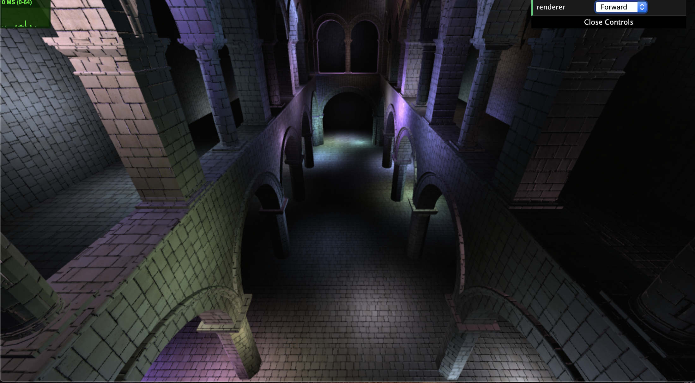
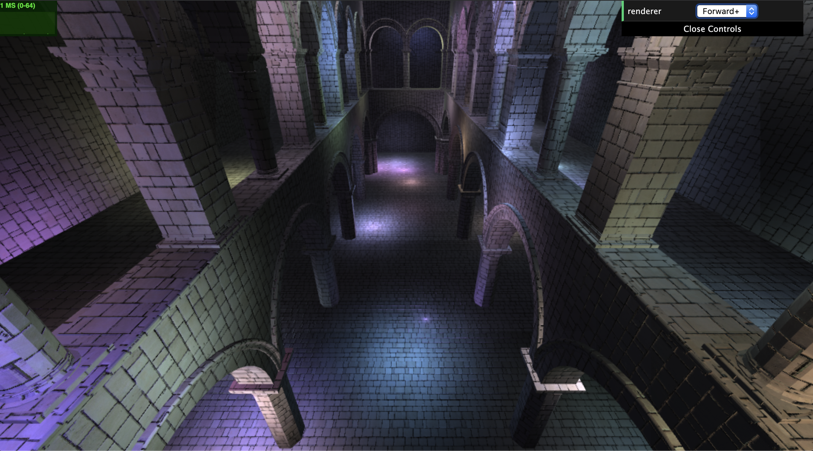
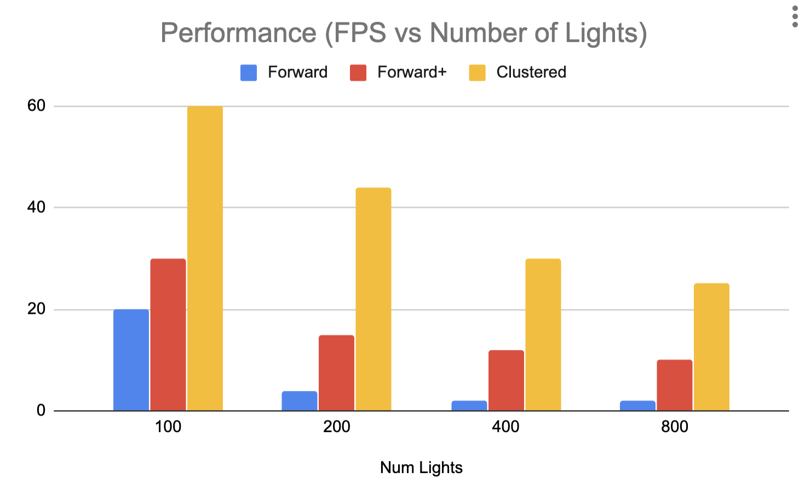

WebGL Clustered and Forward+ Shading
======================

**University of Pennsylvania, CIS 565: GPU Programming and Architecture, Project 6**

* Srinath Rajagopalan
* Tested on: Google Chrome (v78), Macbook Pro, Intel-Core-i5 8th Gen, Intel Iris Graphics

	

### WebGL Shading

In this project, we use the web browser using WebGL to do real-time rendering. We explore three rendering techniques and analyze their performance. At at 1000-ft view, for forward rendering, we loop through all the light sources, and for each of them we compute the interaction with all the geometries present in the scene and determine projection of a 3D vertex onto to a 2D canvas and figure out how to color it. This is accompolished by the graphics pipeline consisting of a vertex shader followed by the fragment shader (where most of the heavy-lifiting happens).

## Forward Plus Rendering

The naive approach described above searches through ALL light source - geometry pair. But we can do better. We tile the 3D scene into discrete cells. For each light source we compute the tiles which will be affected by the light. Since not all lights will affect all the objects, we can reduce our search space significantly. This is similar to the uniform-grid cell construction we employed in the Boids-Flocking project. However, not all the tiles are of equal volume. We can imaging a frustum extending from camera plane a max-reach depth sliced into `(xSlice, ySLice, zSlice)` tiles. 

	

## Deferred Rendering
In forward we compute the geometry intersection each time we loop through a light source. This can be expensive so it is better to pre-compute the intersections and store it in a geometry buffer. This way the logic to calculate lighting is decoupled from the complexity of the scene. After this, the logic for deferred rendering is pretty much the same as forward rendering.

	

## Blinn–Phong Illumination
To improve lighting, we implement lighting claculations as described in [Blinn-Phong Reflection Model](https://en.wikipedia.org/wiki/Blinn%E2%80%93Phong_reflection_model)

We can observed the effects of the illumination below,

Without Blinn-Phong                   | With Blinn-Phong              |
:-------------------------:|:-------------------------:
| 		

## Performance Analysis

	

Unsurprisingly, forward+ is faster than forward because we don't loop over all the lights for each vertex. Deferred rendering is faster because pre-computing the geometry intersections avoids them being calculated multiple times in the shader. 

### Credits

* [Three.js](https://github.com/mrdoob/three.js) by [@mrdoob](https://github.com/mrdoob) and contributors
* [stats.js](https://github.com/mrdoob/stats.js) by [@mrdoob](https://github.com/mrdoob) and contributors
* [webgl-debug](https://github.com/KhronosGroup/WebGLDeveloperTools) by Khronos Group Inc.
* [glMatrix](https://github.com/toji/gl-matrix) by [@toji](https://github.com/toji) and contributors
* [minimal-gltf-loader](https://github.com/shrekshao/minimal-gltf-loader) by [@shrekshao](https://github.com/shrekshao)
