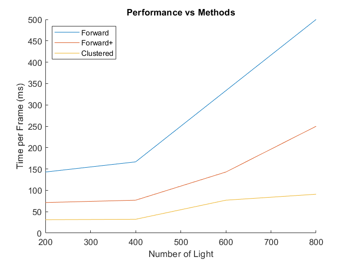
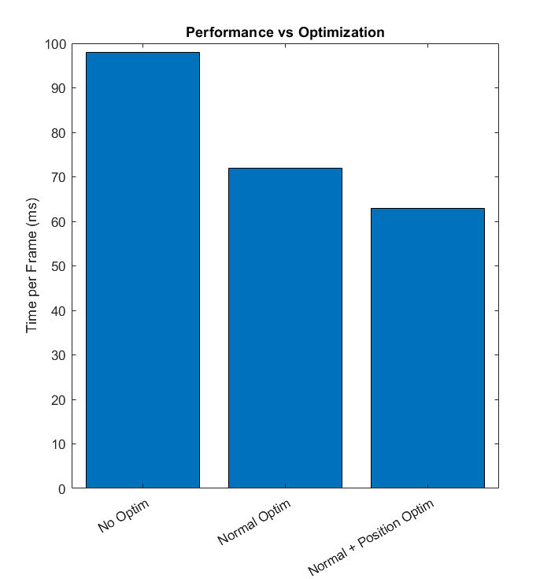

WebGL Clustered and Forward+ Shading
======================

**University of Pennsylvania, CIS 565: GPU Programming and Architecture, Project 6**

* Weiqi Chen
  * [LinkedIn](https://www.linkedin.com/in/weiqi-ricky-chen-2b04b2ab/)
* Tested on: Windows 10, i7-8750H @ 2.20GHz 2.21GHz, 16GB, GTX 1050 2GB

### Live Online
[Link](https://WaikeiChan.github.io/Project6-WebGL-Clustered-Deferred-Forward-Plus/)

### Demo Video on YouTube
[Link](https://youtu.be/N86cCf1wIJo)

## Summary
This is a project of implementing clustered and forward+ shading using WebGL.

### Deferred Shading
This technique decouples lighting from scene complexity. It has one shader per material type and one per light type. It only transforms and rasterize each object once and only lights non-occluded objects.

### Forward+ Shading
This is forward shading with light culling for screen-space tiling. It has 3 passes: depth pre-pass, light culling and final shading. Depth pre-pass goes through the fragment shader and prevent overdraw in light accumulation pass. Light culling computes which light overlaps with which tile. Final shading initiates a Draw call for each material group.

### Clustered Shading
Clustered shading has two more steps then Forward+ shading. It has Depth pre-pass, cluster assignment, finding non-empty clusters, light culling and final shading. Cluster assignment assigns pixels to clusters. Light culling assigns lights to non-empty clusters.

## Performance Analysis

### Shaders Comparison

The plot above shows the performance of the three shading methods vs the number of lights. Clustered shading has the best performance with increasing number of lights. Forward+ shading has a lower FPS with more lights and forward shading performs the worst among the three.

### Optimization

Deferred shading can be optimized by using 2-component normal. That means we can now use `vec2` to store the normals. Using a light number of 500, the time-per-frame of clustered shading decreases from 97ms to 72ms. On top of this, we can reconstruct world space position with camera matrices and X/Y/Depth. Adding this optimization decrease the time-per-frame from 72ms to 63ms. The performance is not improved a lot here and this is probably because the reconstruction part takes more time.

### Credits

* [Three.js](https://github.com/mrdoob/three.js) by [@mrdoob](https://github.com/mrdoob) and contributors
* [stats.js](https://github.com/mrdoob/stats.js) by [@mrdoob](https://github.com/mrdoob) and contributors
* [webgl-debug](https://github.com/KhronosGroup/WebGLDeveloperTools) by Khronos Group Inc.
* [glMatrix](https://github.com/toji/gl-matrix) by [@toji](https://github.com/toji) and contributors
* [minimal-gltf-loader](https://github.com/shrekshao/minimal-gltf-loader) by [@shrekshao](https://github.com/shrekshao)
