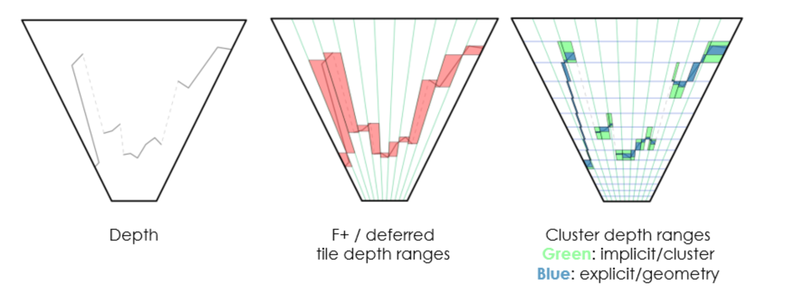
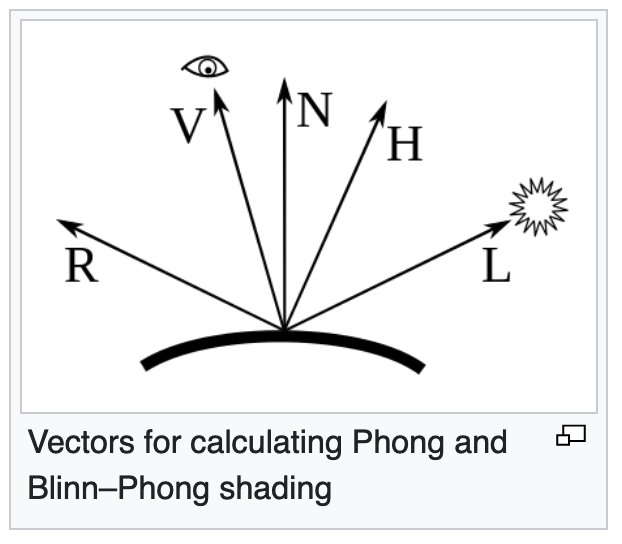
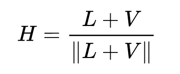
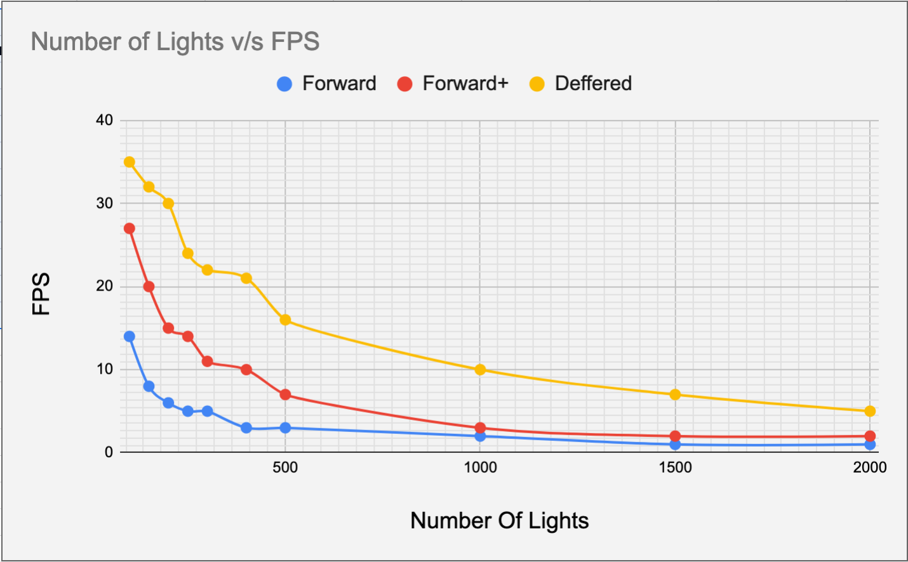

WebGL Clustered and Forward+ Shading
======================

**University of Pennsylvania, CIS 565: GPU Programming and Architecture, Project 5**

* Chhavi Sharma
* Tested on:**Firefox 70.0.1** on OsX 10.14.6 i5 @ 1.6GHz 8GB

### Demo Video/GIF

### Index
- [Introduction](https://github.com/chhavisharma/Project6-WebGL-Clustered-Deferred-Forward-Plus#introduciton)
- [Algorithm and Implementation](https://github.com/chhavisharma/Project6-WebGL-Clustered-Deferred-Forward-Plus#algorithm-and-implementation)
- [Analysis](https://github.com/chhavisharma/Project6-WebGL-Clustered-Deferred-Forward-Plus#analysis )
- [Results](https://github.com/chhavisharma/Project6-WebGL-Clustered-Deferred-Forward-Plus#results)
- [References](https://github.com/chhavisharma/Project6-WebGL-Clustered-Deferred-Forward-Plus#references )

### Introduciton 
We implement a webGL based renderer using three graphics pipleines: Forward, Forward+ and Deferred Rendering, and, show comparative analysis.

### Algorithm and Implementation 
The graphics rendering pipelines differ in the way each process light sources and objects in the scene. They are explained as follows:

#### Forward
Forward rendereing is the navie/default rendering where, after each object is rasterised, the shaders compute the color looking at light and per object in a nested loop. Multipass rendering with naive looping makes forward rendering rather slow. 

#### Forward+
In case of forward+ rendering, the rendering space is divided 2D tiles and light culling is used for efficient color computaitons. It usually has three passes where in the first pass, depth at each visible point is computed, then in the second pass (light culling) each tile is assigned light sources that it is affected by, and finally the shading is done using light sources assosiated with the current tile only. The shaders still have nested for loops but work with limited lights per element. 

#### Deferred
Deferred shading is different from forward plus shading, in that, it defers the actual shading task to a second pass. In a single first pass, geomentry of each point is computed and stored in a buffer, which is utilised in the second pass where the shader computes the colors. The light culling procedure can be added to make the light search more efficient. But defered shading has its limitations where it cannot render translucency efficiently due to gbuffer limitations whereas forward+ can handle translucency.  

The following image shows how the 3D visible space is divided into grids to asign lights to each grid for light culling. 

  

#### Effects
We also implement the [Blinn–Phong](https://en.wikipedia.org/wiki/Blinn%E2%80%93Phong_reflection_model) reflection model that combines diffuse and specular lighting.  It can be seen as an approximation to the Phong model where a halfway vector between the viewer and light-source vectors are computed for faster calculations instead of R ⋅ V {\displaystyle R\cdot V} R\cdot V. 

  

  

This dot product represents the cosine of an angle that is half of the angle represented by Phong's dot product if V, L, N and R all lie in the same plane. This relation between the angles remains approximately true when the vectors don't lie in the same plane, especially when the angles are small. 

### Analysis
We comapre the three rendering pipelines by varying the number of lights rendered and computign the FPS. We can notice that forward is the slowest. 
Clustered/defered is faster than forward+ in most cases in the current setting but it may not always be true. 
Clustered also more memory intensive as comapred to forward plus. 

  

### Results

  

  

### References
* [Three.js](https://github.com/mrdoob/three.js) by [@mrdoob](https://github.com/mrdoob) and contributors
* [stats.js](https://github.com/mrdoob/stats.js) by [@mrdoob](https://github.com/mrdoob) and contributors
* [webgl-debug](https://github.com/KhronosGroup/WebGLDeveloperTools) by Khronos Group Inc.
* [glMatrix](https://github.com/toji/gl-matrix) by [@toji](https://github.com/toji) and contributors
* [minimal-gltf-loader](https://github.com/shrekshao/minimal-gltf-loader) by [@shrekshao](https://github.com/shrekshao)
