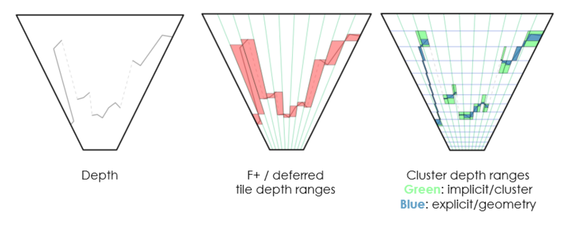
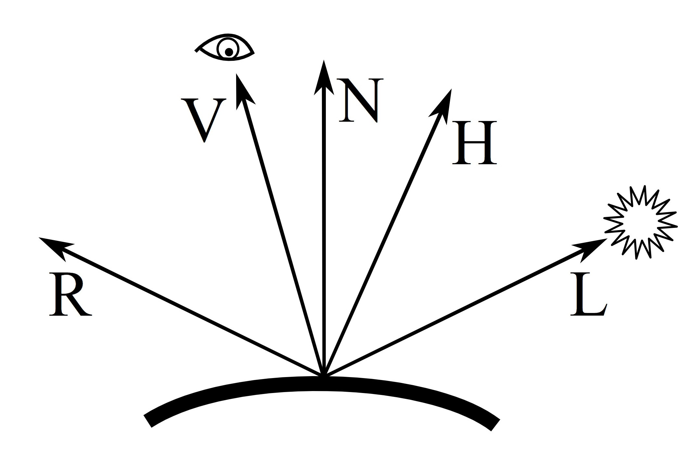
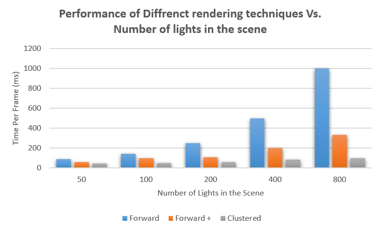
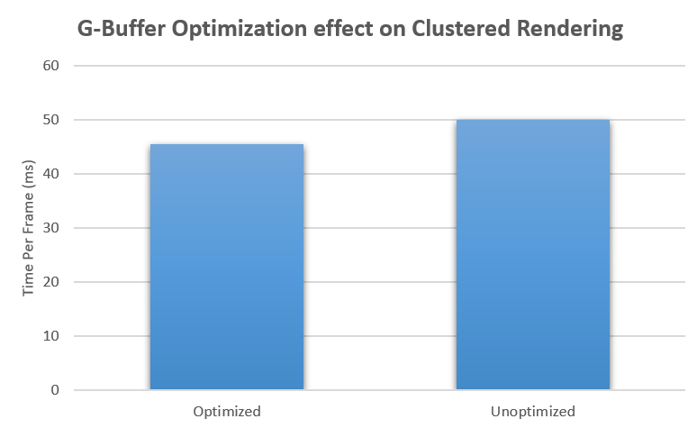
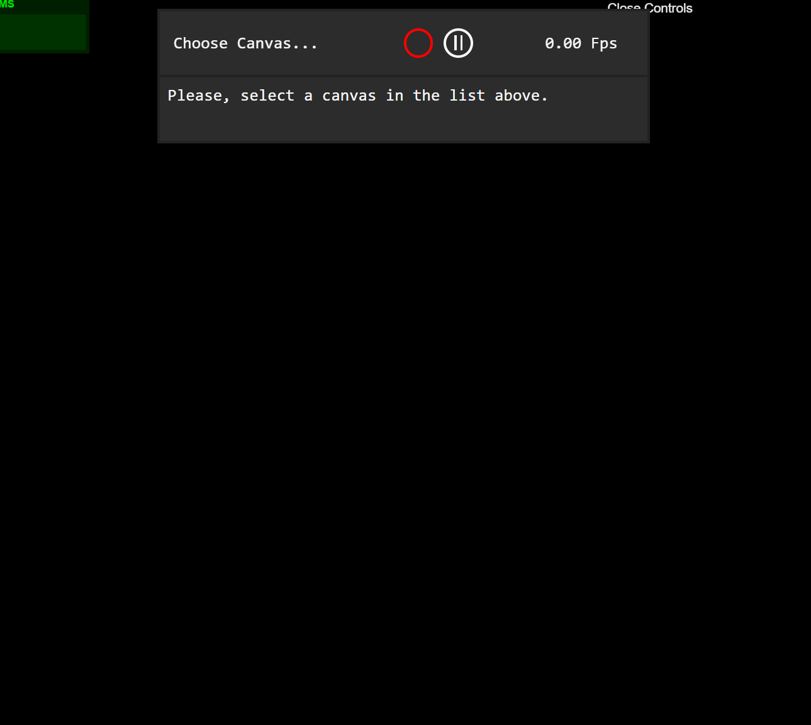

WebGL Clustered and Forward+ Shading
======================

**University of Pennsylvania, CIS 565: GPU Programming and Architecture, Project 6**

Peyman Norouzi
* [LinkedIn](https://www.linkedin.com/in/peymannorouzi)
* Tested on: **Chrome Version 78.0.3904.87** Windows 10, i7-6500 @ 2.40GHz 16GB, Intel HD Graphics 520 (Personal Computer)

  

## Table of Content:

## Introduction:

### What is WebGl?:

WebGL (Web Graphics Library) is a JavaScript API for rendering interactive 2D and 3D graphics within any compatible web browser without the use of plug-ins. WebGL is fully integrated with other web standards, allowing GPU-accelerated usage of physics and image processing and effects as part of the web page canvas. WebGL elements can be mixed with other HTML elements and composited with other parts of the page or page background. WebGL programs consist of control code written in JavaScript (the rendering part of the project) and shader code that is written in OpenGL ES Shading Language (ESSL), a language similar to C or C++, and is executed on a computer's graphics processing unit (GPU) (most of the files in the shader folder of the project). 

## Implementation:

Three different rendering methods (Forward, Forward+ and Clustered(Deferred)) were implemented and then compared against each other in this project. the following visualization shows their differences on an of how they work in comparison and they are as follows:

  

### 1.Forward:

Forward rendering is the standard, naive approach to rendering that is the least computentionally efficient of the three methods listed. it works by by rasterizing each geometric object in the scene. During shading, a list of lights in the scene is iterated to determine how the geometric object should be lit. This means that every geometric object has to consider every light in the scene which can be inefficinet and wasteful.

### 2.Forward +:

Forward + rendering technique improves upon the previous method by deviding the enviroment into tiles. We determine which lights are overlapping in which area of the screen space and use those candidates for the rest of the process. Thus this rendering technique combines forward rendering with tiled light culling to reduce the number of lights that must be considered during shading. Forward+ primarily consists of two stages: 1. Light culling 2.Forward rendering.

### 3.Clustered (Deffered):

Deferred shading and rendering works diffrently by rasterizing all of the scene objects (without lighting) into a series of 2D image buffers that store the geometric information that is required to perform the lighting calculations in a later pass. These buffers are called Geometric Buffers (G-buffer). Ussually Diffuse, Specular, Normals and Depth are the 4 g-buffers that are used in the Deffered rendering. The lighting (final image) is calculated at the end of the process by combining the g-buffers together in an appropriate manner. The following is the rendered using the Deffered method (which is the most computationally efficient method in most cases):

  

### Blinn-Phong Shading:

Blinn-Phong is a lighting method that improves upon Phong shading method. Phong lighting great and very efficient approximation of lighting, but its specular reflections break down in certain conditions, specifically when the shininess property is low resulting in a large (rough) specular area. In Blinn-Phong, halfway vector between the viewer and light-source vectors is computed which imroved the realness of the scene lighting cosiderably. More information can be found [here](https://en.wikipedia.org/wiki/Blinn%E2%80%93Phong_reflection_model). Visualization below shows the implementation of Blinn-Phong Shading: 

  

The visulization below shows the diffrence in scence lighting with and without Blinn-Phong Shading:

| Without Blinn-Phong Shading | With Blinn-Phong Shading |
| ------------- | ----------- |
|   |  |

## Perfomance Implementation and Analysis:

  

### Optimization:

  

### Blooper:

  

## Credits

* [Three.js](https://github.com/mrdoob/three.js) by [@mrdoob](https://github.com/mrdoob) and contributors
* [stats.js](https://github.com/mrdoob/stats.js) by [@mrdoob](https://github.com/mrdoob) and contributors
* [webgl-debug](https://github.com/KhronosGroup/WebGLDeveloperTools) by Khronos Group Inc.
* [glMatrix](https://github.com/toji/gl-matrix) by [@toji](https://github.com/toji) and contributors
* [minimal-gltf-loader](https://github.com/shrekshao/minimal-gltf-loader) by [@shrekshao](https://github.com/shrekshao)
