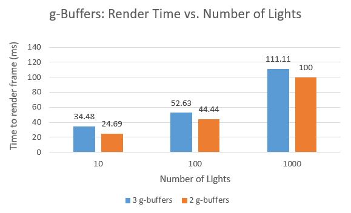

WebGL Clustered and Forward+ Shading
======================

**University of Pennsylvania, CIS 565: GPU Programming and Architecture, Project 6**

* Tabatha Hickman
  * LinkedIn: https://www.linkedin.com/in/tabatha-hickman-335987140/
* Tested on: **Google Chrome 222.2** on
  Windows 10 Pro, i7-5600U CPU @ 2.60GHz 16GB, GeForce 840M (personal computer)

### Live Online

### Demo GIF

## Clustered and Deferred Shading in WebGL

This project explores how we can optimize shader/render pipelines by changing the structure by which geometry and lights are evaluated. A standard pipeline (which we will refer to as Forward rendering) involves going through all the lights in the scene, evaluating which are affecting the given fragment and then evaluating their contribution to the color. This has many downsides, ione of the largest being that we must go through all the lights in the scene when it is likely only a few are actually pertinent to this fragment.

### Forward+

A second method, Forward+ or Clustered Forward rendering, employs clusters to combat this issue. In this method, we slice the view frustum in all three axes into volumes called clusters. Before rendering begins, we create a buffer which holds information about which lights affect which clusters, which is computed based on the positions and radii of the lights. Then in the shader, we compute which cluster this fragment is in, and only evaluate light contributions from the lights we determined affected that cluster.

### Clustered Deferred Shading

A third method implemented also uses this cluster technique, but also uses deferred shading. In deferred shading, there is a first pass where geometry which is not occluded is rasterized and pertinent information (positions, normals, and albedo colors) is stored in a g-buffer, for use later in the shader. This is very useful for scenes with a lot of complex geometry because geometry evaluations need only be done once in this first pass, and don't need to be repeated for every fragment. The combination of these two techniques, one optimizing for lots of lights in the scene, and the other optimizing for geometric complexity, seems to have a lot of promise.

### Performance Analysis

Above is a chart showing the average render times of the scene with 100 lights for each rendering method described. As you can see, Forward rendering performs far worse than either of the two optimized methods. Clustered-deferred appears to be a good bit better than Forward+, which makes sense because both use the cluster technique, but deferred shading has added benefits for geometric complexity. 

Here is a comparison of the three methods with different numbers of lights in the scene. There is very little difference between the times for 10 lights, which makes sense because the cluster optmization improves the times by reducing the number of light computations so if there are already very few lights, the difference is negligible. As we increase the number of lights in the scene to a very large number, it becomes very obvious that using clusters has major benefits. Furthermore, the benfits of deferred shading continue to scale.

### Blinn-Phong

As an additional experiment, to see how more complex lighting computations affected the performance, I implemented Blinn-Phong shading. Evaluation of the soecular component requires the computation of a view vector and a half vector, then computing the dot product of the half vector and the surface normal to the power of some constant (in this case I used 8). This addition is not enormous, but certainly not trivial. Below is a chart of the performance at different numbers of lights for this shading technique when applied to clustered-deferred shading. The addition of Blinn-Phong consistently lowers performance, as expected due to the extra computation, and the severity of that performance impact increases as the number of lights increases, probably because more lights affect each fragment so the Blinn-Phong computations must happen more often.

### Optimizing G-buffers

One additional optimization you could make to the deferred shading is to reduce the number of g-buffers as much as possible. The position, normal, and albedo color are all essential information and each have 3 components. Initially, I used 3 g-buffers, one for each of these vec3s. But then I realized that we have some extra information about normals, we know the length of those vec3s will always be 1. So, I decided to use 2 g-buffers and only send the normal's x and y component. (Each g-buffer is a vec4 so I put the position and the normal's x in the first and the color and the normal's y in the second.) Later in the fragment shader, I reconstructed the z component of the normal using the x and the y. Unfortunately, the one thing I lost about the information is the sign of the z component, so I was getting some artifacts. I think using the view matrix to do some computation could fix this issue. Below is a chart showing the performance benefit of this change. There is a consistent performance increase that seems fairly steady as the number of lights increases, which makes sense because this optimization relates directly to the geometry complexity, and not the lights. THe computation save only comes into play on a per-fragment basis. 

### Credits

* [Three.js](https://github.com/mrdoob/three.js) by [@mrdoob](https://github.com/mrdoob) and contributors
* [stats.js](https://github.com/mrdoob/stats.js) by [@mrdoob](https://github.com/mrdoob) and contributors
* [webgl-debug](https://github.com/KhronosGroup/WebGLDeveloperTools) by Khronos Group Inc.
* [glMatrix](https://github.com/toji/gl-matrix) by [@toji](https://github.com/toji) and contributors
* [minimal-gltf-loader](https://github.com/shrekshao/minimal-gltf-loader) by [@shrekshao](https://github.com/shrekshao)
