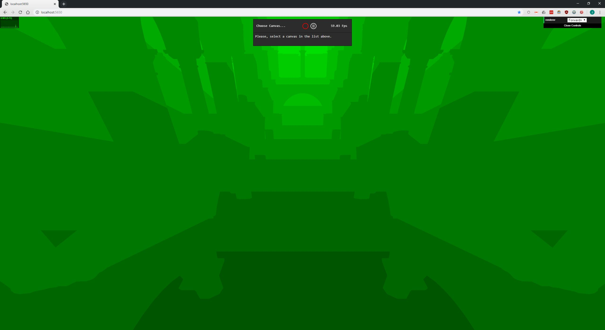
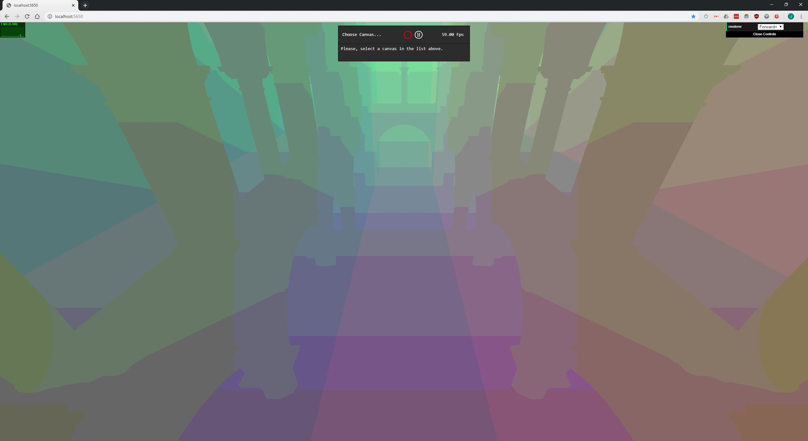

WebGL Clustered and Forward+ Shading
======================

**University of Pennsylvania, CIS 565: GPU Programming and Architecture, Project 6**

* John Marcao
  * [LinkedIn](https://www.linkedin.com/in/jmarcao/)
  * [Personal Website](https://jmarcao.github.io)
* Developed on: Windows 10, i5-4690K @ 3.50GHz, 8GB DDR3, RTX 2080 TI (Mem: 3071MB) (Personal)
* Profiled on: Windows 10, i7-6500U @ 2.50GHz, 8GB DDR3, Intel HD Graphics 520 (Mem: Yes.) (Personal)


### Introduction

The object of this project was to implement a Forward+ and Clustered renderer using WebGL along with Three.JS. Going into this project, I had not experience with WebGL and javascript and only a simple, basic knowledge of rendering. I found that the hardest part of this project was learning to change all my thought processes from CPU-based coding to Pipeline and Rendering based. The hardest part of that was getting used to the terminology used, especially since compute shaders still use a lot of graphics terminology.

I finally found that simpler is ALWAYS better. I started off with some ambitious ideas but found that I didn't know the tools well enough. I fell back to simpler designs, shaving off a few known performance benefits. All things considered, I learned a lot.

### Design

I started off by attacking the Cluster light-culling in base.js. Without light culling, each fragment will shade with each other light in the scene. Since each light has a limited range of influence, this is incredibly wasteful. By implementing the clustering and light-culling, each fragment will read only the lights that will have an effect from a textureBuffer. The light culling is done on the CPU.

I began by following and implementing the light culling algorithm detailed in (http://www.humus.name/Articles/PracticalClusteredShading.pdf)["Practical Clustered Shading"]. This presentation from Avalanche Studios provided a straightforward algorithm. I also combined it with some simple geometry to come up with the following.

```
foreach light
    foreach z
        if light intersects plane(z)                    (1)
            foreach y
                if line(x0,y, x1,y) intersects light    (2)
                    get clusters from intersection      
                    populate clusters
                fi
            end
        fi
    end
end
```

I found that my implementation was flawed. Marked above are two areas where my algorithm initially failed. In (1), I realized that a sphere may be in the cluster bounded below by z, but this if statement would not catch it. In (2), I found a bigger issue. What if a light is located inside a cluster, but does not intersect any boundaries? In this case the light would be totally ignored. I saw this in action when lights in the farthest clusters would disappear and reappear as they crossed the boundaries between clusters.

I still like the idea of the algorithm above, but I found that line intersections were insufficient. I made two major changes.First of all, I opted to do Box Intersections. To do this, I would loop through each cluster and from a box bound by cluster. This isn't 100% equivalent to the cluster since they are not cubes, but this is sufficient for the goal. Secondly, I moved the light loop to the inner loop. I did this to tighten the loop, since the lights could be up in the 1000s. My updated algorithm is the following.

```
foreach z
    foreach y
        foreach x
        box = (x,y,z),(x+1,y+1,z+1)
        foreach light
            if box intersects light   
                populate clusters
            fi
        end
    end
end
```

Note that once an intersection is found, it does not matter where the exact position is (something the previous algorithm needed to know). This algorithm seems to work well, and I see most, if not all the lights appear in my rendered output. However, I found that this is SLOW. Far too slow to provide any benefit. Lastly, I approached my final design. Much simpler, much more blunt, but it works.

```
find minimums for xyz
foreach z in zmin, zmax
    foreach y in ymin, ymax
        foreach x in xmin, xmax
            populate clusters
        end
    end
end
```

This design avoids ugly intersection tests, building new geometries, or anything else. There is some more culling to be done, but this approach worked.

I next focused on the fragment shader. This is where the data stored in the CPU side code would be read and rendered. Most of the logic was already implemented, I just needed to add indexing to the cluster texture to cull the list of lights that needed to be checked. The logic is not quite right, as the image is still choppy. My biggest hurdle here was validating that the cluster indices were being calculated correctly. Being in a shader, it was hard to debug anything, and mt attempt at exporting data from the shader ended pretty quickly. I was able to setup some debug views however that absolutely helped.

My original indexing had issues on the edges of the screen. Instead of having clusters from edge to edge, it was only going about halfway before being merged into one supercluster. This was due to the translation between view space, world space, and screen space. I was mixing up values in different coordinate systems, which caused all sorts of odd behavior. Once I simplified my intersection algorithm, it created a far simpler cluster index calculation. I took advantage of that.

My last major issue was light indexing. I was lost on how to properly access textureBuffers in WebGL. It finally clicked when I thought of the buffers as having some width and some depth, but width is measured in objects and depth is measured in floats. Once I grasped that, the indexing became much easier.

### Blinn-Phong Shading

I implemented a very simple Blinn-Phong Shader. The performance impact of this shader is minimal, since it only performs a bit of extra computation in each fragment shader. Since this is spread out by the GPU, this helps mask the slowdown.

| Without BP | With BP |
|-----------|--------|
|  |  |

### Debug Views

Below are some of the debug views. The normal and albedo views basically came for free.

| Debug View | Output    |
|-----------|--------|
| Cluster X-Values |  |
| Cluster Y-Values |  |
| Cluster Z-Values |  |
| Cluster XYZ-Values |  |
| Normals |  |
| Albedo |  |

### Profiling

NOTE! I did profiling on my Dell Laptop with the following Specs:

TODO

### Conclusion

TODO


### Credits

* [Three.js](https://github.com/mrdoob/three.js) by [@mrdoob](https://github.com/mrdoob) and contributors
* [stats.js](https://github.com/mrdoob/stats.js) by [@mrdoob](https://github.com/mrdoob) and contributors
* [webgl-debug](https://github.com/KhronosGroup/WebGLDeveloperTools) by Khronos Group Inc.
* [glMatrix](https://github.com/toji/gl-matrix) by [@toji](https://github.com/toji) and contributors
* [minimal-gltf-loader](https://github.com/shrekshao/minimal-gltf-loader) by [@shrekshao](https://github.com/shrekshao)
