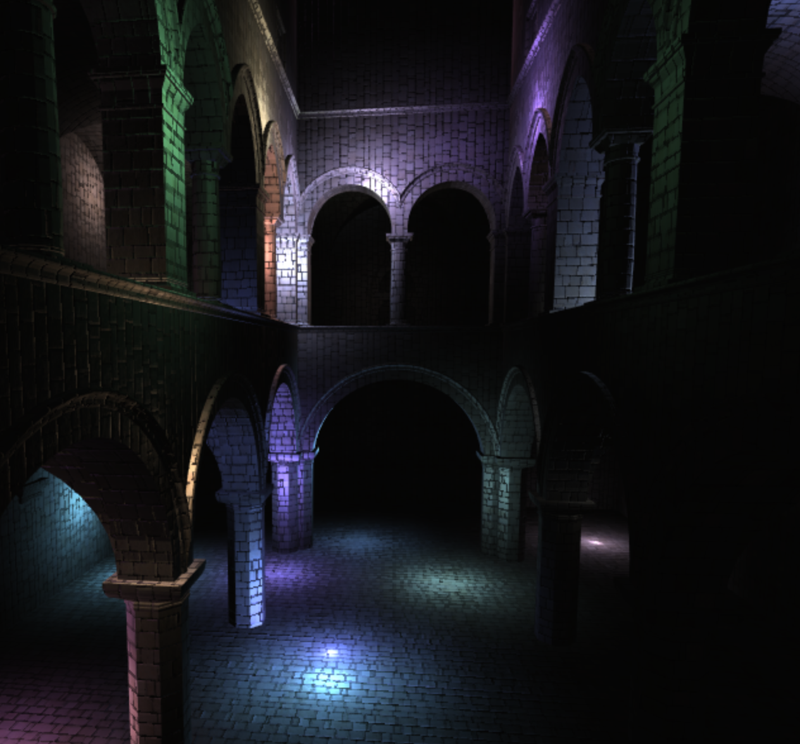

WebGL Clustered and Forward+ Shading
======================

**University of Pennsylvania, CIS 565: GPU Programming and Architecture, Project 5**

* Chhavi Sharma
* Tested on: (TODO) **Firefox 70.0.1** on
  OsX 10.14.6 i5 @ 1.6GHz 8GB

### Live Online

### Demo Video/GIF
[]

### Index
- [Introduction]()
- [Algorithm]()
- [Implementation Details]( )
- [Analysis]( )
- [Results](  )
- [References]( )

### References
* [Three.js](https://github.com/mrdoob/three.js) by [@mrdoob](https://github.com/mrdoob) and contributors
* [stats.js](https://github.com/mrdoob/stats.js) by [@mrdoob](https://github.com/mrdoob) and contributors
* [webgl-debug](https://github.com/KhronosGroup/WebGLDeveloperTools) by Khronos Group Inc.
* [glMatrix](https://github.com/toji/gl-matrix) by [@toji](https://github.com/toji) and contributors
* [minimal-gltf-loader](https://github.com/shrekshao/minimal-gltf-loader) by [@shrekshao](https://github.com/shrekshao)
